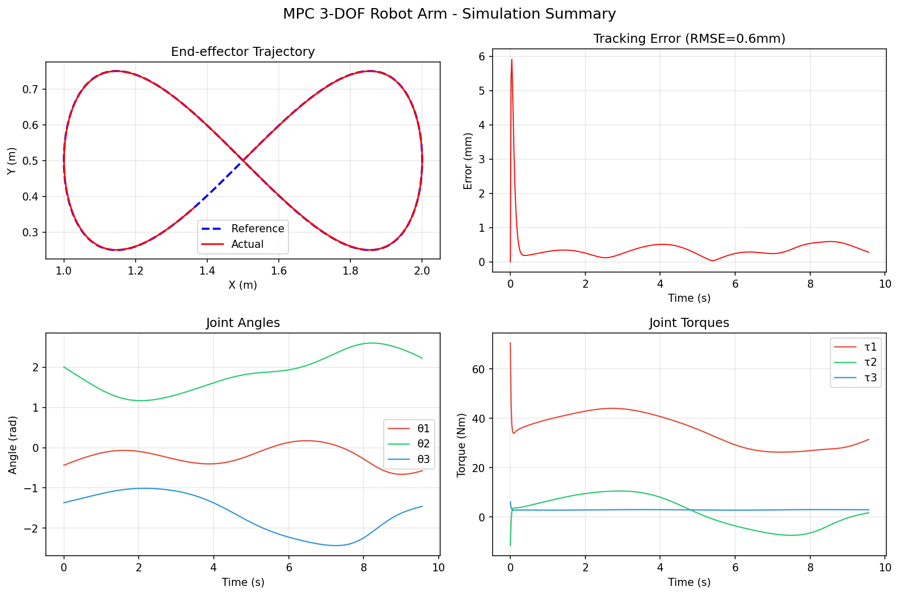
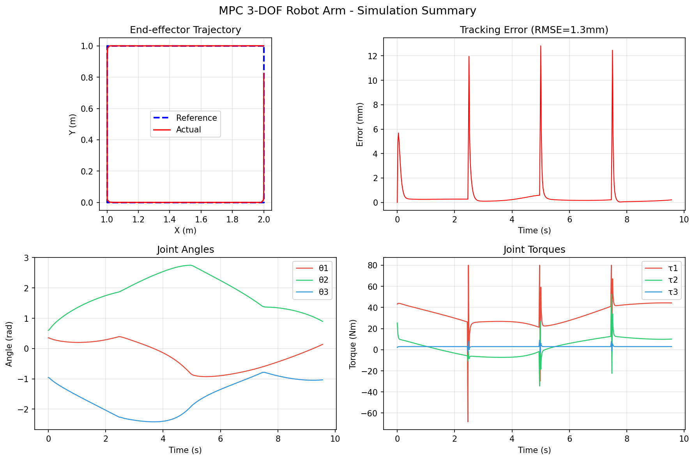

# Robot Arm MPC - 三轴机械臂轨迹跟踪控制

用 **MPC（模型预测控制）** 让一个虚拟的三关节机械臂，沿着你指定的轨迹（圆形、8字形、方形）精确运动。

## 效果预览

| 八字形轨迹 | 方形轨迹 |
|:-:|:-:|
|  |  |

## 这个项目在干嘛？

想象你有一个三段式机械臂（像人的上臂+前臂+手掌），你希望它的"手掌"沿着某个形状运动，比如画一个圆。

难点在于：机械臂有三个关节，每个关节需要施加不同的力矩（扭矩），而且关节之间会互相影响（甩动第一个关节会带动后面的）。这就需要一个智能控制器来实时计算每个关节该用多大的力。

**MPC 就是这个智能控制器。** 它的工作方式：

```
每一步（0.02秒）：
  1. 看一眼当前机械臂的状态（角度、角速度）
  2. 预测未来 20 步的运动
  3. 计算最优的力矩组合
  4. 施加力矩，机械臂动一下
  5. 回到第 1 步
```

## 项目结构

```
robot-arm-mpc/
├── main.py              # 入口脚本，运行仿真的起点
├── arm_dynamics.py      # 机械臂物理模型（质量、惯量、重力等）
├── mpc_controller.py    # MPC 控制器（计算该施加多大的力矩）
├── trajectory.py        # 轨迹生成器（画圆、画8、画方）
├── simulator.py         # 仿真主循环（一步一步推进模拟）
├── visualizer.py        # 可视化（动画 + 图表）
└── README.md
```

**各模块关系：**

```
trajectory.py  ──生成目标轨迹──▶  simulator.py  ──调用控制器──▶  mpc_controller.py
     │                              │                              │
     │                              │◀──返回最优力矩───────────────┘
     │                              │
     │                              ▼
     │                        arm_dynamics.py  （计算机械臂下一步状态）
     │                              │
     │                              ▼
     └──────────────────────── visualizer.py  （画图、生成动画）
```

## 安装

需要 Python 3.8+，安装依赖：

```bash
pip install casadi numpy scipy matplotlib
```

- **CasADi**：符号计算+数值优化库，MPC 的核心
- **NumPy / SciPy**：数值计算
- **Matplotlib**：画图和动画

## 使用方法

### 最简单的运行方式

```bash
python main.py
```

默认画一个圆形轨迹，仿真 10 秒，生成 `summary.png`。

### 换一种轨迹

```bash
# 画 8 字形
python main.py --trajectory figure_eight

# 画方形
python main.py --trajectory square
```

### 调整参数

```bash
# 仿真 20 秒，轨迹半径 0.3 米
python main.py --trajectory circle --duration 20 --radius 0.3

# 只看静态汇总图，不生成动画
python main.py --no-animate --save-plot result.png

# 保存动画为 mp4（需要安装 ffmpeg）
python main.py --save animation.mp4
```

### 全部参数

| 参数 | 默认值 | 说明 |
|------|--------|------|
| `--trajectory` | `circle` | 轨迹类型：`circle` / `figure_eight` / `square` |
| `--duration` | `10.0` | 仿真时长（秒） |
| `--dt` | `0.02` | 控制时间步长（秒），越小越精确但越慢 |
| `--Np` | `20` | MPC 预测步数，看得越远控制越稳 |
| `--Nc` | `10` | MPC 控制步数 |
| `--radius` | `0.5` | 轨迹半径（米） |
| `--save` | 无 | 动画保存路径（.mp4 或 .gif） |
| `--no-animate` | 关闭 | 跳过动画，只生成静态图 |
| `--save-plot` | `summary.png` | 静态汇总图保存路径 |

## 输出示例

运行后终端会打印：

```
==================================================
3-DOF Robot Arm MPC Trajectory Tracking
==================================================
Trajectory: circle
Duration: 10.0s, dt: 0.02s
MPC: Np=20, Nc=10

[1/5] Building arm dynamics model...
[2/5] Generating reference trajectory...
  Trajectory points: 500
[3/5] Building MPC controller...
[4/5] Running simulation...
  Simulation completed in 2.3s
  Steps: 479
  MPC solve rate: 100.0%
  Max tracking error: 12.34 mm
  Mean tracking error: 5.67 mm
  RMSE: 6.78 mm
[5/5] Visualizing...
```

- **Max tracking error**：手掌离目标轨迹的最大偏差（毫米）
- **RMSE**：均方根误差，越小越好

## 什么是 MPC？（通俗解释）

**MPC = Model Predictive Control = 模型预测控制**

打个比方：你在开车，前方有个弯道。

- **普通 PID 控制器**：只看方向盘现在偏了多少，立刻修正。反应快但容易"过头"。
- **MPC 控制器**：先在脑子里模拟"如果我这样打方向盘，未来 10 秒车会怎么走"，然后选一个最好的方案执行。

MPC 的核心步骤：

```
         当前状态
            │
            ▼
  ┌─────────────────┐
  │ 预测未来 N 步    │  ← 用物理模型（质量、惯量、重力）
  │ 每步都算代价     │  ← 偏离目标越远，代价越高
  │ 找到代价最小方案  │  ← 数学优化（CasADi 求解器）
  └─────────────────┘
            │
            ▼
      只执行第一步
      （下一帧重新算）
```

这就是为什么 MPC 每一步都要重新计算——它只执行"计划的第一步"，然后根据新的状态重新规划。这样即使有扰动也能自动修正。

## 机械臂模型

三连杆平面机械臂，所有关节在同一平面内运动：

```
  基座 ●━━━━━━●━━━━━━●━━━━━━● 末端（手掌）
       L1=1.0m  L2=0.8m  L3=0.6m
       m1=2.0kg m2=1.5kg m3=1.0kg
```

物理方程：`M(θ)θ̈ + C(θ,θ̇)θ̇ + G(θ) = τ`

| 符号 | 含义 |
|------|------|
| `θ` | 关节角度 |
| `M(θ)` | 惯量矩阵（质量分布） |
| `C(θ,θ̇)` | 科里奥利力（旋转产生的耦合力） |
| `G(θ)` | 重力 |
| `τ` | 施加的力矩（控制器输出） |

## 许可证

MIT
